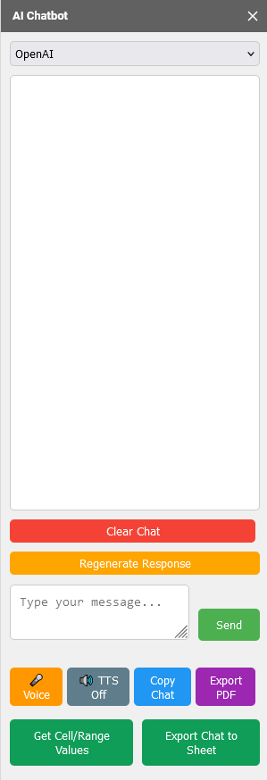

# AI Chatbot for Google Sheets

This project implements an AI-powered chatbot sidebar within Google Sheets, allowing users to interact with various AI models directly alongside their spreadsheet environment. The chatbot provides a convenient way to access AI capabilities while working in Google Sheets, though it does not directly manipulate spreadsheet data.

### Quick Deployment

Go to **File > Make a copy**.

## Key Features

- Integration with multiple AI providers:
  - OpenAI
  - Groq
  - Together
  - Google (Gemini)
  - Anthropic (Claude)
  - Hyperbolic
  - Mistral
  - Cerebras
  - SambaNova
- Easy-to-use sidebar interface for chat interactions
- Support for voice input and text-to-speech output
- Option to export chat conversations to a separate sheet
- Functionality to reference spreadsheet data in conversations
- Secure API key management for each provider

## Setup Instructions

1. Open your Google Sheet.
2. Go to **Extensions > Apps Script**.
3. Create two new files:
   - `sidebar.html`: Paste the provided HTML code.
   - `Code.gs`: Paste the provided script.
4. Save the project and close the Apps Script editor.
5. Refresh your Google Sheet, and the **AI Chatbot** menu will appear in the toolbar.
6. Click on **AI Chatbot** in the menu and select any option.
7. A prompt will appear asking for authorization. Click **Continue**.
8. Sign in with your Google account and click **Allow** to grant the required permissions.

Continue to the next step to set up your API key.

### Getting Your API Key

To use the AI Chatbot, you need to set up your API key. Here’s how to do it for OpenAI:

1. Go to [OpenAI API Keys](https://platform.openai.com/api-keys).
2. Sign in to your OpenAI account (or create one if you don’t have an account).
3. Click on **Create new secret key** and copy your API key.
4. Go back to your Google Sheets.
5. Click on **AI Chatbot** in the menu.
6. Select **OpenAI** from the submenu.
7. Click **Set API Key** and enter your API key when prompted.

**Note**: If you plan to use other AI providers, you will need to follow similar steps to obtain and set their API keys. Each provider will have its own process for generating API keys, usually found in their account or developer settings.

Continue to the next step to start using the AI Chatbot!

### Starting the AI Chatbot Sidebar

1. Once your API keys are set up, click on **AI Chatbot** > **Start AI Chatbot** to open the sidebar.
2. Select your AI provider from the dropdown menu.
3. Enter your message and click **Send** or press **Enter**.
4. The AI's response will appear in the chat window.

Congratulations on successfully running the AI Chatbot! Enjoy exploring its capabilities!

## Important Security Notes

1. **API Key Protection**: Your API keys are stored in the script's properties and are not visible in the sheet itself. However, anyone with edit access to the sheet can potentially access these keys through the Apps Script project.

2. **Data Privacy**: Be cautious about sharing sheets containing sensitive conversations or data. Remember that exported chats and logs are visible to anyone with access to the sheet.

3. **Usage Limits**: Be aware of the usage limits and costs associated with each AI provider. This script does not implement rate limiting or usage tracking.

4. **Content Filtering**: This chatbot does not implement content filtering. Be mindful of the inputs provided and the potential outputs from the AI models.

## Troubleshooting

If you encounter issues:

1. Check that your API keys are correctly set and have the necessary permissions.
2. Ensure you have a stable internet connection.
3. Check the Apps Script execution log for any error messages.

## Contributing

This project is open for contributions. Feel free to fork the repository, make improvements, and submit pull requests.

## Disclaimer

This project is not officially associated with or endorsed by any of the AI providers mentioned. Use it at your own risk and in compliance with each provider's terms of service.

## To-Do

- [ ] More model selection
- [ ] More user-friendly interaction with the sheets
- [ ] Custom API endpoints
- [ ] More features coming soon
